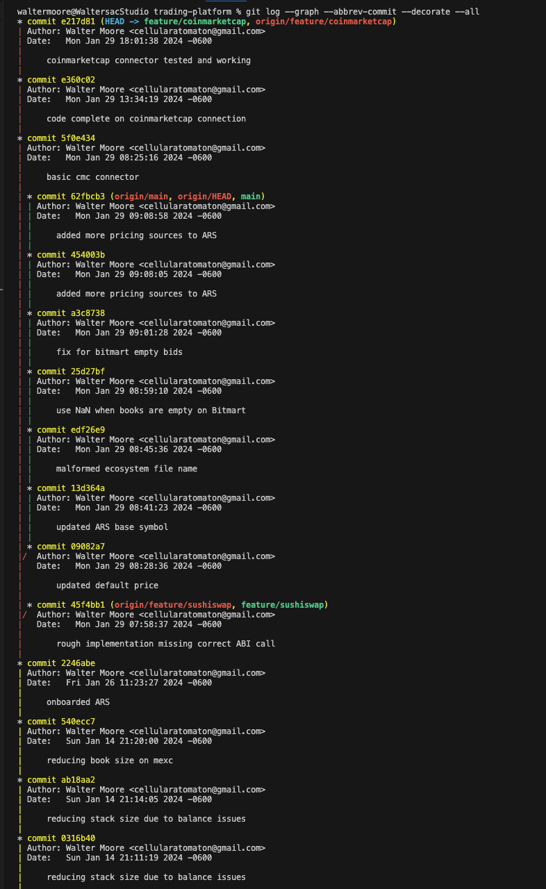
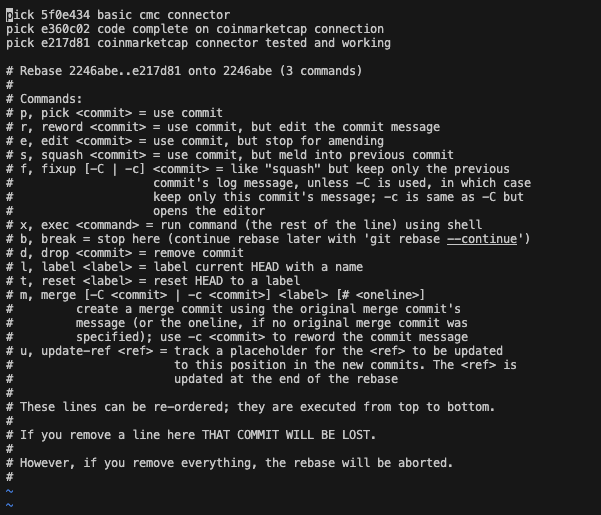
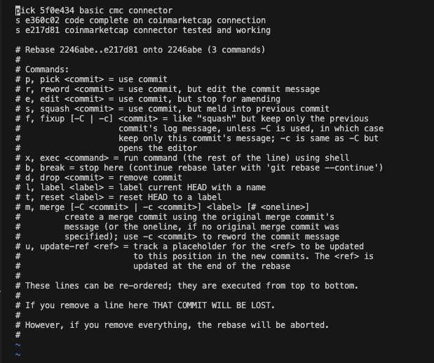
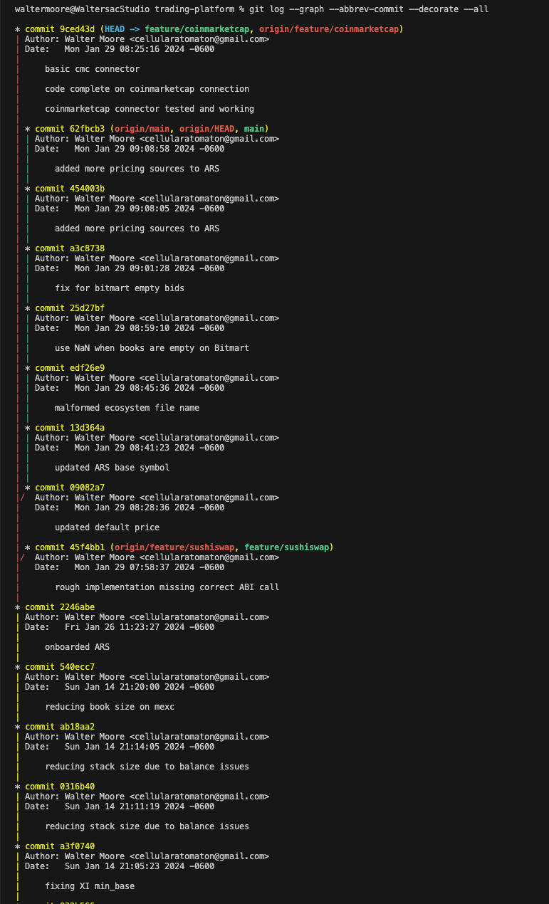
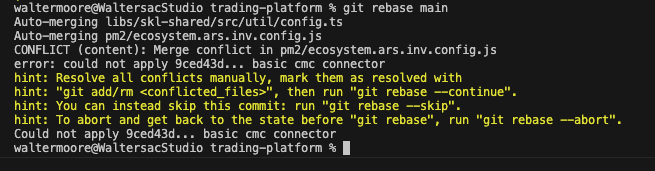
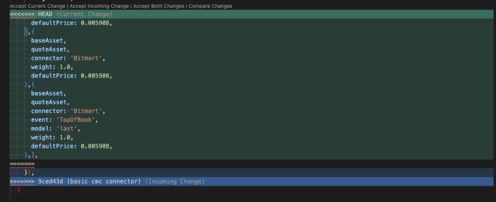
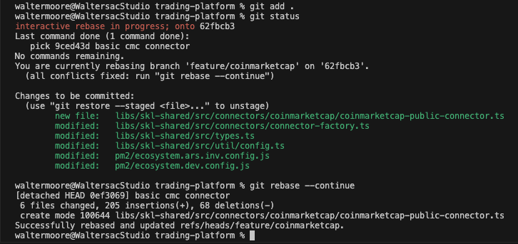
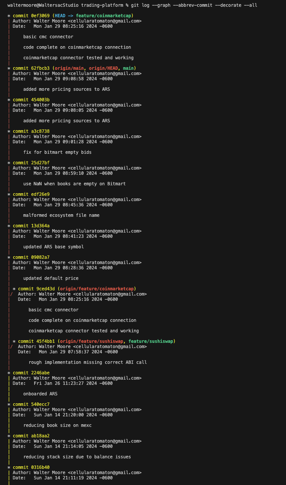

### **VOXY** AI: Source Control

## Note:
This document assumes you are rebasing against main(master).  The same procedures apply to rebasing against any other branch as well  (for example, a release branch)

## Prepare
First, make sure all of your changes are committed.  Any uncommitted changes should be stashed or otherwise saved.  Then use these command to view the source tree of your current local branch:

```
git checkout main
git pull origin main
git checkout feature/branch
git log --graph --abbrev-commit --decorate --all
```
If your current local branch is already directly derived from main(master), then no rebase should be necessary.  It is still a good idea to squash changes before submitting a pull request.  However, it is likely that your tree looks more like this:



This screen shot is from another codebase, but the key thing to notice is that the `feature/coinmarketcap` branch forked from main 3 commits ago according to its own history.  From `main`'s perspective, the fork happened 7 commits ago. Also note that `feature/coinmarketcap` and `main` each have different commit histories since the fork.  This is the typical situation where we want to do the following procedure:

1. Squash
2. Rebase
3. Submit Pull Request

We will now cover each of these separately.

## Squash
Squashing your commits BEFORE you rebase makes it much easier to merge.  
```
git checkout feature/branch
git rebase -i HEAD~N
git push origin feature/branch --force
```

The command `rebase -i HEAD~N` puts git in "interactive mode" for the last `N` commits.  This opens the system text editor (usually vi, nana, emacs, etc) and allows you to perform mutations to the branch history.  `HEAD~3` will allow you to squash the last 3 commits on your branch.  When the rebase has started, you'll see something like the following in your text editor:



Use your text editor to change the word "pick" to "squash" or simply the letter "s".  ProTip:  The instructions for how to use the interactive session are commented below the list of commits.  Take your time, there is no rush here.



When you save the file, your interactive rebase will be applied to the local branch.  Now you should see the squashed commits in your history:

```
git log --graph --abbrev-commit --decorate --all
```



If you don't need to rebase and are just squashing your commits in order to create a Pull Request, then you can skip the next section.

## Rebasing

```
git checkout main
git pull origin main
git checkout feature/branch
git rebase main
```

```
git push origin feature/branch --force
```

## When it doesn't go as planned
It is possible to to really make a mess of a rebase, especially if there are a large number of commits.  This is why it is so important to first squash the commits on your development branch and force push those changes to origin. If you make a big mess and need to start over, abandon the current working directory, and clone your branch frresh into a new directory.  Then try again!



If you have conflicts, VS Code offers a nice tool for resolving them:



Once you have resolved all conflicts, you can continue the rebase:

```
git add .
git rebase --continue
```




## When it DOES go as planned
If your rebase went well, then you your feature/branch should no longer be forked from main, but rather... it will have been re-based! 



Now you are ready to force push the rebased code to origin:

```
git push origin feature/branch --force
```

## GitHub Pull Request
ToDo